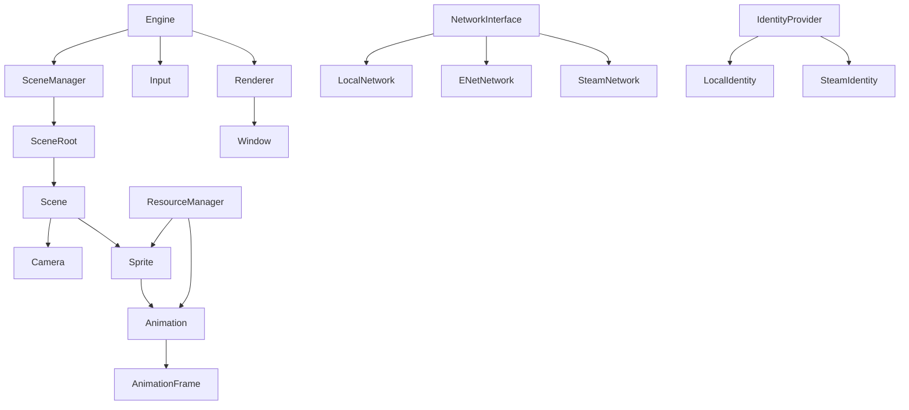

# Architecture Index

Master lookup for Igneous documentation, classes, and source locations.

## Top-Level Documentation

| Document | Description |
|----------|-------------|
| [../README.md](../README.md) | Project overview and quick start |
| [how-to-build.md](how-to-build.md) | Terminal and VS Code/Cursor build and run instructions |
| [code-reference.md](code-reference.md) | Code formatting, conventions, and architectural patterns |
| [tech-debt.md](tech-debt.md) | Known issues and improvement areas |
| [examples/README.md](examples/README.md) | Standalone feature demos and how to run them |
| [tests.md](tests.md) | Unit test index and how to run `igneous_tests` |
| [architecture.md](architecture.md) | This index — all classes and docs in one place |

## Subsystems

## Engine (`include/igneous/engine/`)

| Name | Kind | Header | Doc |
|------|------|--------|-----|
| `Engine` | class | `include/igneous/engine/Engine.hpp` | [Engine.md](classes/Engine.md) |
| `Camera` | class | `include/igneous/engine/Camera.hpp` | [Camera.md](classes/Camera.md) |
| `Event` | template class | `include/igneous/engine/Event.hpp` | [Event.md](classes/Event.md) |
| `Vec2` | template struct | `include/igneous/engine/Vec2.hpp` | [Vec2.md](classes/Vec2.md) |
| `Vec3` | template struct | `include/igneous/engine/Vec3.hpp` | [Vec3.md](classes/Vec3.md) |
| `Time` | class | `include/igneous/engine/Time.hpp` | [Time.md](classes/Time.md) |
| `ThreadPool` | class | `include/igneous/engine/ThreadPool.hpp` | [ThreadPool.md](classes/ThreadPool.md) |
| `ThreadSafeQueue` | template class | `include/igneous/engine/ThreadSafeQueue.hpp` | [ThreadSafeQueue.md](classes/ThreadSafeQueue.md) |
| `Database` | class | `include/igneous/engine/Database.hpp` | [Database.md](classes/Database.md) |
| `CFGParser` | class | `include/igneous/engine/CFGParser.hpp` | [CFGParser.md](classes/CFGParser.md) |
| `Perlin` | class | `include/igneous/engine/PerlinNoise.hpp` | [Perlin.md](classes/Perlin.md) |

## Input (`include/igneous/input/`)

| Name | Kind | Header | Doc |
|------|------|--------|-----|
| `Input` | class | `include/igneous/input/Input.hpp` | [Input.md](classes/Input.md) |
| `InputEvent` | struct | `include/igneous/input/InputEvent.hpp` | [InputEvent.md](classes/InputEvent.md) |
| `InputLayer` | class | `include/igneous/input/InputLayer.hpp` | [InputLayer.md](classes/InputLayer.md) |

## Rendering (`include/igneous/rendering/`)

| Name | Kind | Header | Doc |
|------|------|--------|-----|
| `Renderer` | class | `include/igneous/rendering/Renderer.hpp` | [Renderer.md](classes/Renderer.md) |
| `Window` | class | `include/igneous/rendering/Window.hpp` | [Window.md](classes/Window.md) |

## Scenes (`include/igneous/scenes/`)

| Name | Kind | Header | Doc |
|------|------|--------|-----|
| `Scene` | class | `include/igneous/scenes/Scene.hpp` | [Scene.md](classes/Scene.md) |
| `SceneManager` | class | `include/igneous/scenes/SceneManager.hpp` | [SceneManager.md](classes/SceneManager.md) |
| `SceneRoot` | class | `include/igneous/scenes/SceneRoot.hpp` | [SceneRoot.md](classes/SceneRoot.md) |

## Resources (`include/igneous/resources/`)

| Name | Kind | Header | Doc |
|------|------|--------|-----|
| `ResourceManager` | class | `include/igneous/resources/ResourceManager.hpp` | [ResourceManager.md](classes/ResourceManager.md) |
| `TextureDeleter` | struct | `include/igneous/resources/ResourceManager.hpp` | [TextureDeleter.md](classes/TextureDeleter.md) |
| `Sprite` | class | `include/igneous/resources/Sprite.hpp` | [Sprite.md](classes/Sprite.md) |
| `Animation` | class | `include/igneous/resources/Animation.hpp` | [Animation.md](classes/Animation.md) |
| `AnimationFrame` | struct | `include/igneous/resources/AnimationFrame.hpp` | [AnimationFrame.md](classes/AnimationFrame.md) |
| `AudioStream` | class | `include/igneous/resources/AudioStream.hpp` | [AudioStream.md](classes/AudioStream.md) |

## Networking (`include/igneous/networking/`)

| Name | Kind | Header | Doc |
|------|------|--------|-----|
| `IdentityProvider` | abstract class | `include/igneous/networking/IdentityProvider.hpp` | [IdentityProvider.md](classes/IdentityProvider.md) |
| `LocalIdentity` | class | `include/igneous/networking/LocalIdentity.hpp` | [LocalIdentity.md](classes/LocalIdentity.md) |
| `SteamIdentity` | class | `include/igneous/networking/SteamIdentity.hpp` | [SteamIdentity.md](classes/SteamIdentity.md) |
| `NetworkInterface` | abstract class | `include/igneous/networking/NetworkInterface.hpp` | [NetworkInterface.md](classes/NetworkInterface.md) |
| `NetworkEventType` | enum | `include/igneous/networking/NetworkEvents.hpp` | [NetworkEvents.md](classes/NetworkEvents.md) |
| `NetworkMessage` | struct | `include/igneous/networking/NetworkEvents.hpp` | [NetworkEvents.md](classes/NetworkEvents.md) |
| `Serializer` | class | `include/igneous/networking/Serializer.hpp` | [Serializer.md](classes/Serializer.md) |
| `Deserializer` | class | `include/igneous/networking/Serializer.hpp` | [Serializer.md](classes/Serializer.md) |
| `LocalNetwork` | class | `include/igneous/networking/LocalNetwork.hpp` | [LocalNetwork.md](classes/LocalNetwork.md) |
| `ENetNetwork` | class | `include/igneous/networking/ENetNetwork.hpp` | [ENetNetwork.md](classes/ENetNetwork.md) |
| `NetworkLoopbackLink` | class | `include/igneous/networking/NetworkLoopbackLink.hpp` | — |
| `NetworkSessionFactory` | class | `include/igneous/networking/NetworkSessionFactory.hpp` | — |
| `PacketRouter` | class | `include/igneous/networking/PacketRouter.hpp` | — |
| `PacketTypes` | enums | `include/igneous/networking/PacketTypes.hpp` | — |
| `SteamNetwork` | class | `include/igneous/networking/SteamNetwork.hpp` | [SteamNetwork.md](classes/SteamNetwork.md) |

## External / Build Docs

| Location | Description |
|----------|-------------|
| `CMakeLists.txt` | Root build configuration, dependency wiring, optional Steamworks |
| `cmake/Igneous.cmake` | Consumer API: `igneous_add_subdirectory`, `igneous_add_executable`, fetch helper |
| `cmake/IgneousHelpers.cmake` | Runtime dependency copying for game executables |
| `template/game/` | Starter CMake project for new games |
| `scripts/setup.sh` | Submodule init + configure + build bootstrap |
| `libs/steamworks/README.md` | Steamworks SDK setup (when using `IGNEOUS_STEAM`) |
