# Stabilization Roadmap

Work to complete **before adding new engine systems**. This roadmap covers bugs, cleanup, refactors, inconsistencies, and test/CI gaps only — no new features.

Each phase is ordered by dependency: later phases assume earlier ones are done. Every section ends with **acceptance criteria** you can verify with automated tests or a short manual check.

For current subsystem layout, see [Architecture Index](architecture.md). For the living debt list, see [Tech Debt](tech-debt.md).

---

## Phase 1 — CI and test harness

**Status: Complete** (2026-07-18)

Nothing else is safe to refactor without a gate that catches regressions on every push.

### 1.1 Root CI workflow

Add a GitHub Actions (or equivalent) workflow at the repo root that:

- Initializes submodules
- Configures with the debug preset and `-DIGNEOUS_BUILD_TESTS=ON`
- Builds `igneous`, `igneous_tests`, and at least one example target
- Runs `ctest --output-on-failure`

**Acceptance criteria**

- [x] CI runs on pull requests and on pushes to the default branch (`.github/workflows/ci.yml`).
- [x] A deliberate compile error in `src/` fails the workflow.
- [x] `./build/tests/igneous_tests` is executed via CTest and must pass.

### 1.2 Test fixture hygiene

Static singletons (`Input`, `Window`, `CFGParser`, `SceneManager`, `ResourceManager`, `Time`, `Camera::main`) leak state between Catch2 test cases. Several tests mutate globals without restoring them.

Add shared reset helpers (e.g. extend `SdlFixture` or add per-subsystem `ResetForTests()` functions) and call them in fixture setup/teardown.

**Acceptance criteria**

- [x] Running `./build/tests/igneous_tests` twice in a row produces identical pass/fail results.
- [x] Running `./build/tests/igneous_tests "[input]"` followed by `./build/tests/igneous_tests "[scenes]"` does not fail due to leftover input layers or scene roots.
- [x] New tests that touch static managers use the reset helper by convention (document in [Tests](tests.md)).

---

## Phase 2 — Critical correctness bugs

**Status: Complete** (2026-07-18)

Fix behavior that is wrong today or can crash at runtime.

### 2.1 Engine init failure handling

`Engine::Run` always calls `SceneManager::GetSceneRoot()->AddScene(...)` even when `Init()` sets `running = false` (e.g. SDL init failure). That can null-dereference. Init also continues after partial failures instead of stopping cleanly.

**Work**

- Guard `Run` so it skips `AddScene`, the main loop, and partial cleanup paths when init fails.
- Return a non-zero exit code on init failure.
- Stop initializing further subsystems after the first fatal failure, or unwind what was already initialized.

**Acceptance criteria**

- [x] New test `[engine][init]` simulates init failure (mock or inject a failing init step) and verifies `Run` returns non-zero without crashing.
- [x] Successful init still passes existing tests unchanged.

### 2.2 `Vec2` / `Vec3` math precision

`Dot()` and `Magnitude()` use `int` intermediates and `std::pow` on integral values. Float instantiations lose precision; large integers can overflow. `Vec2::operator!=` is hard-coded to `Vec2<float>` instead of `Vec2<T>`.

**Work**

- Use `T` (or `float`/`double` promotion) for dot, magnitude, and cross products.
- Fix `operator!=` to compare same-type operands.

**Acceptance criteria**

- [x] Extend `[engine][vec2]` with float dot/magnitude cases that fail today (e.g. `{0.1f, 0.2f}` magnitude, non-axis-aligned dot products).
- [x] Add `[engine][vec3]` tests for float `Dot`, `Magnitude`, and `Normalized` on fractional values.
- [x] All vec tests pass.

### 2.3 `AudioStream::Play` empty-track edge case

If `Play()` runs before `ResourceManager::LoadSound` has created mixer tracks, the fallback path uses `tracks.begin()->first` on an empty map — undefined behavior.

**Work**

- Ensure tracks are lazily initialized inside `Play`, or assert/return early with a logged error when the mixer is unavailable.

**Acceptance criteria**

- [x] New test `[resources][audiostream]` constructs an `AudioStream` and calls `Play` without prior `LoadSound`; must not crash.
- [x] Test passes when all tracks are busy (steals oldest track) and when the mixer is initialized.

### 2.4 Self-contained headers

`IdentityProvider.hpp` uses `std::vector<uint8_t>` without `#include <vector>`. It compiles only when another header pulls `<vector>` in first.

**Acceptance criteria**

- [x] Compile a minimal TU that includes only `IdentityProvider.hpp` (add a compile test or a `[networking][headers]` test file).
- [x] Build succeeds with `-Werror` if the project enables it for tests.

---

## Phase 3 — Serialization and wire format

**Status: Complete** (2026-07-18)

Networking examples and `PacketRouter` depend on an implicit 2-byte packet header. The default `Deserializer` offset (`startOffset = 2`) is undocumented and easy to misuse (unit tests pass `0` explicitly; examples rely on the default).

### 3.1 Document and centralize the packet header

**Work**

- Add a named constant (e.g. `NetworkProtocol::HeaderSize` or `PacketHeaderBytes`) and a small helper to skip/write the header.
- Document the layout in [Serializer / Deserializer](classes/Serializer.md) and cross-link from [NetworkEvents](classes/NetworkEvents.md).
- Replace magic `2` and bare `startOffset` arguments at call sites.

**Acceptance criteria**

- [x] New test `[networking][serializer][header]` builds a packet with `Serializer`, reads it back through `PacketRouter::DispatchMessage`, and asserts handler payload matches.
- [x] Test fails if the header size constant is wrong.

### 3.2 `CFGParser::GetUInt16` type mismatch

Method name and docs imply `uint16_t`; declaration and implementation use `uint32_t`.

**Acceptance criteria**

- [x] Return type is `uint16_t`; out-of-range values are rejected or clamped with a logged warning.
- [x] New test `[engine][cfgparser]` covers `WriteUInt16` / `GetUInt16` round trip and an out-of-range value.

### 3.3 Endianness and portability (document first)

`Serializer` / `Deserializer` use native endianness via `reinterpret_cast`. Cross-platform peers will break silently.

**Work (no wire-format redesign yet)**

- Document the limitation prominently in header comments and [Serializer.md](classes/Serializer.md).
- Add a test `[networking][serializer][endian]` that at minimum asserts round-trip consistency on the current platform (guards against future accidental layout changes).

**Acceptance criteria**

- [x] Docs state that messages are **not** portable across endianness without an explicit conversion layer.
- [x] Round-trip test passes on CI (little-endian Linux).

---

## Phase 4 — Engine lifecycle and static state

**Status: Complete** (2026-07-18)

Hardcoded defaults and split responsibilities make the core loop fragile and hard to test in isolation.

### 4.1 Configurable window and engine bootstrap

`Engine::InitSDL()` hardcodes 640×360 and title `"client"`. There is no public API to configure this before init.

**Work**

- Add a minimal init settings struct or parameters (width, height, title) consumed by `Engine::Run` or `InitSDL`.
- Keep sensible defaults matching current behavior.

**Acceptance criteria**

- [x] New test `[engine][window]` (or extend `[rendering][window]`) verifies custom dimensions/title after init via the new API.
- [x] Existing examples compile without changes (defaults unchanged).

### 4.2 Unified window resize handling

`Engine::HandleEvents` updates `Window::viewport` on `SDL_EVENT_WINDOW_RESIZED`. `Input::HandleEvent` sets `Input::wasWindowResized` separately. Callers must know both paths.

**Work**

- Route resize through one place (prefer `Window::OnResize(w, h)` called from `Engine`).
- Deprecate or delegate `Input::wasWindowResized` to the window module.

**Acceptance criteria**

- [x] New test `[rendering][window][resize]` pumps a synthetic `SDL_EVENT_WINDOW_RESIZED` through `Engine::HandleEvents` (or `Window` API) and asserts viewport and resize flag stay in sync.
- [x] `Input::WasWindowResized()` (or replacement) reflects the same event once.

### 4.3 Static manager testability

`Input`, `Window`, `Renderer`, `ResourceManager`, `SceneManager`, `Time`, and `Camera::main` use static inline state. This blocks multiple engine instances and causes test pollution (see Phase 1.2).

**Work**

- Add documented `Reset()` / `Shutdown()` hooks for tests (full DI refactor is out of scope).
- Ensure `Engine::Clean` and test fixtures call them.

**Acceptance criteria**

- [x] After `Engine::Clean()` or test reset, `SceneManager::GetSceneRoot()` is null, input layers are empty except `_default`, and `Camera::main` is null.
- [x] `[scenes][scenemanager]` and `[input]` tests use reset and pass in isolation and in full suite order.

---

## Phase 5 — API consistency and safe patterns

**Status: Complete** (2026-07-18)

Reduce undefined behavior and confusion without changing feature surface.

### 5.1 `ThreadSafeQueue` namespace

Template lives in the global namespace; everything else is `Engine::`.

**Acceptance criteria**

- [x] Move to `Engine::ThreadSafeQueue` (keep a deprecated alias if needed for one release).
- [x] `[engine][threadsafqueue]` passes; no global-namespace `ThreadSafeQueue` references remain in `include/` or `src/`.

### 5.2 `SceneRoot::AddScene` cast

Returns `reinterpret_cast<T*>` after `std::make_unique<T>()`. Should be `static_cast<T*>`.

**Acceptance criteria**

- [x] `[scenes][sceneroot]` still passes.
- [x] Grep shows no `reinterpret_cast` in `SceneRoot.hpp`.

### 5.3 Scene virtual hook visibility

`Scene` declares `OnCreated`, `Update`, `Render`, `HandleInputs`, `OnDestroyed` as **private** virtual methods. Derived classes override with public methods — valid C++ but unconventional and confusing.

**Work**

- Move hooks to `protected:` without changing call semantics.

**Acceptance criteria**

- [x] `[scenes][scene]` and `[scenes][sceneroot]` pass.
- [x] Example scenes compile unchanged.

### 5.4 `Event` return type ignored

`Event<Ret, Args...>` accepts a return type but `Emit()` always discards callback results.

**Work**

- Either propagate/aggregate return values for `void`-alternative designs, or simplify to `Event<Args...>` and remove the unused template parameter.

**Acceptance criteria**

- [x] `[engine][event]` passes.
- [x] If `Ret` is kept, add a test proving return values are used (or document that only `void` is supported and `static_assert` otherwise).

---

## Phase 6 — Documentation sync

**Status: Complete** (2026-07-18)

Stale docs cause wrong integrations and duplicate work.

### 6.1 Replace removed transport references

Stale docs referenced a removed ENet transport type; the implementation is [ENetNetwork](classes/ENetNetwork.md).

**Acceptance criteria**

- [x] No stale transport references remain in active docs (`code-reference.md`, `NetworkInterface.md`, `tech-debt.md`).
- [x] [NetworkInterface.md](classes/NetworkInterface.md) lists `LocalNetwork`, `ENetNetwork`, `SteamNetwork`.

### 6.2 Undocumented networking helpers

[Architecture Index](architecture.md) lists `NetworkLoopbackLink`, `NetworkSessionFactory`, `PacketRouter`, and `PacketTypes` without class docs.

**Work**

- Add minimal `docs/classes/*.md` entries (API summary, header path, test tags).
- Document that loopback linking uses `ILoopbackNetwork` / `NetworkSessionFactory::LinkLoopback`, not a removed `SetLoopbackPeer` on `NetworkInterface`.

**Acceptance criteria**

- [x] Every public header under `include/igneous/networking/` has a matching row in `architecture.md` with a doc link.
- [x] Links resolve (file exists).

### 6.3 Header and API doc gaps

- `ResourceManager` and `AudioStream` headers have empty Doxygen blocks.
- [code-reference.md](code-reference.md) requires `// Doc: docs/classes/<Name>.md` as the first header line; no header currently has this.

**Acceptance criteria**

- [x] Spot-check script or CI step: every `include/igneous/**/*.hpp` either has a `// Doc:` line or is listed in an explicit exceptions table in [code-reference.md](code-reference.md).
- [x] `ResourceManager` and `AudioStream` headers have `@brief` summaries matching their class docs.

---

## Phase 7 — Subsystem test coverage

**Status: Complete** (2026-07-18)

Close gaps listed in [Tests](tests.md) so refactors in Phases 2–6 stay pinned.

| Subsystem | Missing coverage | Target tags |
|-----------|------------------|-------------|
| **Engine** | Init failure, `GetUInt16`, float vec3 math | `[engine][init]`, `[engine][cfgparser]`, `[engine][vec3]` |
| **Input** | `InputBinding` key/mouse/gamepad polling, action value aggregation | `[input][inputbinding]`, `[input][inputaction]` |
| **Rendering** | Resize sync, custom window init | `[rendering][window][resize]` |
| **Scenes** | `LoadScene` unload-all, tag removal, singleton scenes | `[scenes][sceneroot]` |
| **Resources** | Texture load (headless/smoke), sprite register/unregister, z-index update, audio load/play | `[resources][resourcemanager]`, `[resources][audiostream]` |
| **Networking** | Header dispatch, `NetworkSessionFactory::CreateLocalClientServer`, optional ENet localhost session | `[networking][serializer][header]`, `[networking][networksessionfactory]`, `[networking][enet]` |

**Acceptance criteria**

- [x] Each new tag appears in [Tests](tests.md).
- [x] `./build/tests/igneous_tests` passes locally and in CI.
- [x] Coverage excludes optional Steam builds unless `IGNEOUS_STEAM=ON` (document skipped tags in Tests doc).

---

## Phase 8 — Subsystem hardening (no new systems)

**Status: Complete** (2026-07-18)

Lower-priority cleanup that stabilizes existing modules.

### 8.1 Resource ID assignment

`ResourceManager::RegisterSprite` and `LoadSound` assign random `int` IDs in a loop until unique. Collisions are unlikely but nondeterministic; debugging and saves suffer.

**Work**

- Monotonic ID generator starting from a fixed seed in tests.

**Acceptance criteria**

- [x] Test `[resources][resourcemanager]` registers multiple sprites and asserts IDs are unique and strictly increasing in a single run.
- [x] Unregister + re-register gets a new ID (document behavior).

### 8.2 `PacketType` duplicate enumerators

`PacketTypes.hpp` contains paired names (`ConnectionRequest` / `ConnectionRequest_`, etc.) likely carried from a prior codebase.

**Work**

- Audit usages in `src/` and examples; remove dead duplicates or alias with comments tying to protocol version.

**Acceptance criteria**

- [x] No unused `PacketType` values remain without a comment explaining wire compatibility.
- [x] `[networking][packetrouter]` still passes.

### 8.3 Optional UPnP in `ENetNetwork`

Server startup spawns a UPnP mapping thread via miniupnpc unless `localOnly` is set. Failures are silent aside from logs; not all deployments want UPnP.

**Work**

- Make UPnP opt-in via a constructor flag or connect parameter (default off for local/dev).

**Acceptance criteria**

- [x] Test `[networking][enet]` creates a local-only server/client session without UPnP threads (existing `localOnly` path).
- [x] New test confirms UPnP thread is not started when disabled.

### 8.4 Steam stub clarity

When `IGNEOUS_STEAM_ENABLED` is off, `SteamNetwork` / `SteamIdentity` compile to stubs that log once and no-op.

**Acceptance criteria**

- [x] Document in [SteamNetwork.md](classes/SteamNetwork.md) and build docs.
- [x] Test `[networking][steam][stub]` (runs only without Steam): calling `Connect()` does not crash and leaves `Connected() == false`.

### 8.5 Split `PerlinNoise.hpp`

Full noise, PNG export, and surface building live in one header — long compile times and mixed concerns.

**Work**

- Move PNG/surface I/O to `.cpp`; keep noise API in the header.

**Acceptance criteria**

- [x] `[engine][perlin]` passes unchanged.
- [x] A clean rebuild touching only a non-Perlin TU does not recompile Perlin PNG code (verify with `ninja -d explain` or equivalent).

---

## Suggested execution order (summary)

```mermaid
flowchart LR
    P1[Phase 1 CI and fixtures]
    P2[Phase 2 Critical bugs]
    P3[Phase 3 Serialization]
    P4[Phase 4 Engine lifecycle]
    P5[Phase 5 API consistency]
    P6[Phase 6 Documentation]
    P7[Phase 7 Test coverage]
    P8[Phase 8 Hardening]

    P1 --> P2
    P2 --> P3
    P3 --> P4
    P4 --> P5
    P5 --> P6
    P6 --> P7
    P7 --> P8
```

| Order | Phase | Why first |
|-------|-------|-----------|
| 1 | CI and test harness | Gates all later work |
| 2 | Critical bugs | Crashes and wrong math block everything |
| 3 | Serialization | Networking and examples depend on wire layout |
| 4 | Engine lifecycle | Window/resize/static state affect every subsystem |
| 5 | API consistency | Low-risk refactors safe once tests exist |
| 6 | Documentation sync | Prevents reintroducing removed APIs |
| 7 | Test coverage | Locks in Phases 2–6 |
| 8 | Hardening | IDs, UPnP, Perlin split, Steam stubs |

---

## Out of scope for this roadmap

The following are **new features** or large rewrites — track separately, not here:

- New engine subsystems (physics, ECS, scripting, asset pipeline, etc.)
- Full dependency injection replacing static managers
- Cross-endian wire format or protocol versioning beyond documentation
- Replacing git submodules with a package manager
- Turning examples into automated integration tests (valuable, but a separate initiative)

When a phase completes, remove or update the matching row in [Tech Debt](tech-debt.md) and add any new test tags to [Tests](tests.md).
